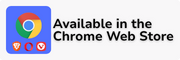

# YT Tweaks

A collection of tweaks for hiding Shorts, disabling auto-dubbing, disabling 'Video paused. Continue watching?', changing the number of videos per row and more!

## Install

 

## Features
- Change the number of videos per row / Change the size of thumbnails
- Video grid: Hide profile pictures/Decrease font size
- Show full video titles
- Hide Shorts, Mixes, watched videos, upcoming videos and live streams
- Hide irrelevant search results (For you, People also watched, Previously watched etc.)
- Search results in Grid view
- More animations
- Compact left sidebar/header bar
- Channel page: Default to Videos tab
- Open search results in new tab
- YouTube logo: Redirect to Subscriptions
- Homepage: Hide topic bar and Latest YouTube posts
- Auto-expand comments
- Show comments in sidebar
- Like/dislike shortcuts
- Auto-expand video description
- Default video quality / Auto HD/4k/8k
- Default video speed
- Custom speeds for each channel / Per-channel video speed
- Quickly adjust playback speed and volume with the mouse wheel
- Seek the video with the mouse wheel
- Video focus
- Volume boost
- Mono audio
- Force original audio track
- Video screenshot button/hotkey
- Flip videos horizontally/vertically / Mirror videos
- Pause the previous video when another starts playing
- Disable 'Video paused. Continue watching?'
- Disable auto-play next video in playlists
- Disable number keys shortcuts
- Auto-scroll Shorts
- Pin video while scrolling
- Show video remaining time
- Hide video controls on pause
- Always show progress bar
- Live chat next to video in full screen mode
- Fullscreen Theater mode
- Ambient mode on Theater mode
- Nyan cat progress bar
- Bring the red subscribe button back
- Watch page: Allow opening channels from the sidebar
- Watch page: Hide end cards and buttons Share, Download, Clip, Thanks and Save
- Left sidebar: Hide Shorts button, Explore and More from YouTube
- Navigation shortcuts (Home, Subscriptions, Shorts)
- Video playback shortcuts (Seek, undo seek, change volume, speed and quality, toggle loop)
- Scroll to top shortcut
- Show back to top button
- Over 100 YouTube themes
- Custom CSS/JavaScript
